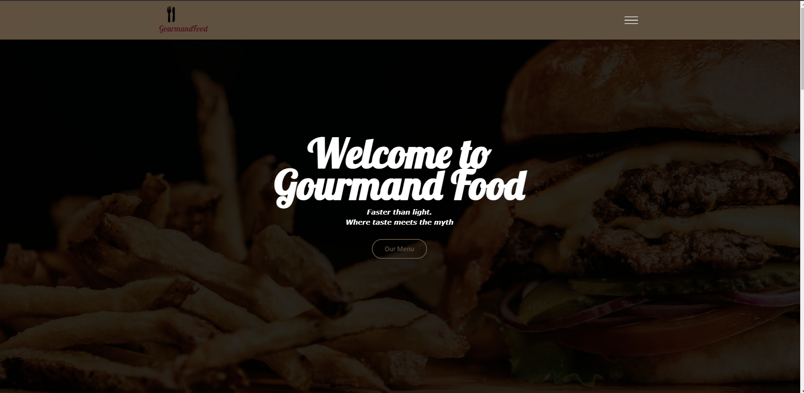
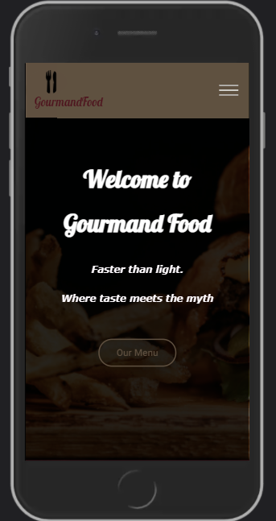
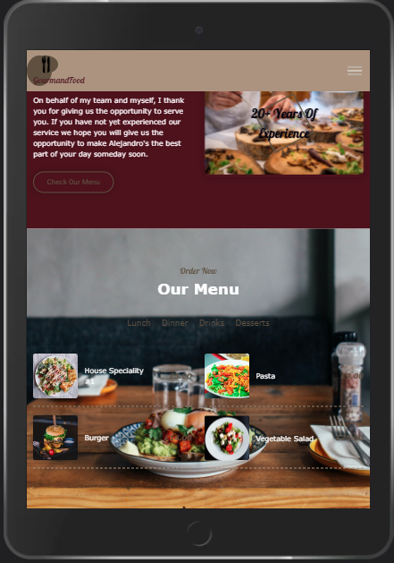

<h1 align="center"Gourmand Food Website</h1>

[View the live project here.](https://valentinhacked.github.io/MS2-Project/)

This is the website for the Gourmand Food Restaurant. It is designed to be responsibe and accessible on a range of devices, making it easy to navigate for potential clients.

<h2 align="center"></h2>

## User Experience (UX)

-   ### User stories

    -   #### First Time Visitor Goals

        1. As a First Time Visitor, I want to easily understand the main purpose of the site and learn more about the restaurant.
        2. As a First Time Visitor, I want to be able to easily navigate throughout the site to find content.
        3. As a First Time Visitor, I want to look for testimonials to understand what their users think of them and see if they are trusted. I also want to locate their social media links to see their followings on social media to determine how trusted and known they are.

    -   #### Returning Visitor Goals

        1. As a Returning Visitor, I want to find information about any new menu items .
        2. As a Returning Visitor, I want to find the best way to get in contact with the restaurant with any questions I may have.


-   ### Design
    -   #### Colour Scheme
        -   The two main colours used are Judge Grey #5E503F, and Bordeaux #49111C.
    -   #### Typography
        -   The Lobster font is the main font used throughout the whole website with Cursive as the fallback font in case for any reason the font isn't being imported into the site correctly. Heebo, as a secondary font, is a clean font used frequently in programming, so it is both attractive and appropriate.
    -   #### Imagery
        -   Imagery is important. The large, background hero image is designed to be striking and catch the user's attention.

*   ### Wireframes

    -   Desktop Wireframe - [View](https://github.com/ValentinHacked/MS2-Project/blob/master/wireframes/MS2-DesktopVireframe.pdf)

    -   Mobile Wireframe - [View](https://github.com/../../wireframes/MobileView-Wireframe.pdf)


## Features

-   Responsive on all device sizes

    <h2 align="center"></h2>

    <h2 align="center"></h2>

-   Interactive elements

## Technologies Used

### Languages Used

-   [HTML5](https://en.wikipedia.org/wiki/HTML5)
-   [CSS3](https://en.wikipedia.org/wiki/Cascading_Style_Sheets)

### Frameworks, Libraries & Programs Used

1. [AOS:](https://michalsnik.github.io/aos/)
    - Animate on scroll library was used for the Javascript on scroll animations throughout the website.
2. [Google Fonts:](https://fonts.google.com/)
    - Google fonts were used to get the 'Lobster' and "Heebo" fonts which are used on all sections throughout the project.
3. [Font Awesome:](https://fontawesome.com/)
    - Font Awesome was used on all pages throughout the website to add icons for aesthetic and UX purposes.
4. [Git](https://git-scm.com/)
    - Git was used for version control by utilizing the Gitpod terminal to commit to Git and Push to GitHub.
5. [GitHub:](https://github.com/)
    - GitHub is used to store the projects code after being pushed from Git.
6. [Logodesign:](https://www.logodesign.net/logos/restaurant-food)
    - Logodesign was used to generate the logo for the website.
7. [Balsamiq:](https://balsamiq.cloud/)
    - Balsamiq Cloud was used to create the wireframes during the design process.

      -   Desktop Wireframe - [View](https://github.com/ValentinHacked/MS1-Project/blob/master/wireframes/MS2-DesktopVireframe.pdf)

      -   Mobile Wireframe - [View](https://github.com/ValentinHacked/MS2-Project/blob/master/wireframes/MobileView-Wireframe.pdf)

## Testing

The W3C Markup Validator and W3C CSS Validator Services were used to validate every page of the project to ensure there were no syntax errors in the project.

-   [W3C Markup Validator](https://validator.w3.org/) - [Results](https://validator.w3.org/nu/?doc=https%3A%2F%2Fvalentinhacked.github.io%2FMS2-Project%2F)
-   [W3C CSS Validator](https://jigsaw.w3.org/css-validator/) - [Results][(https://github.com/](https://jigsaw.w3.org/css-validator/validator?uri=https%3A%2F%2Fvalentinhacked.github.io%2FMS2-Project%2F&profile=css3svg&usermedium=all&warning=1&vextwarning=&lang=en))

### Testing User Stories from User Experience (UX) Section

-   #### First Time Visitor Goals

    1. As a First Time Visitor, I want to easily understand the main purpose of the site and learn more about the restaurant.

        1. Upon entering the site, users are automatically greeted with a greeting message. Underneath there is a Hero Image with Text and a "Our Menu" Call to action button.
        2. The main points are made immediately with the hero image
        3. The user has two options, click the call to action buttons or scroll down, both of which will lead to the same place, to learn more about the restaurant's menu.

    2. As a First Time Visitor, I want to be able to easily be able to navigate throughout the site to find content.

        1. The site has been designed to be fluid and never to entrap the user.
        2. The navigation bar follows the user throughout the website for clear navigation between sections.

    3. As a First Time Visitor, I want to look for testimonials to understand what their users think of them and see if they are trusted. I also want to locate their social media links to see their following on social media to determine how trusted and known they are.
        1. Once the new visitor has read the About Us and the Team section, they will notice the Testimonials section.
        2. The user can also scroll to the bottom of any page on the site to locate social media links in the footer.
        3. At the bottom of the page, the user is told that they can contact the restaurant on social media which highlights the links to them.

-   #### Returning Visitor Goals

    1. As a Returning Visitor, I want to find the newly added recipes and deals.

        1. These are clearly shown in the order menu.

    2. As a Returning Visitor, I want to find the best way to get in contact with the organisation with any questions I may have.

        1. The navigation bamenur clearly highlights the "Contact Us" Page.
        2. Here they can message the restaurant on social media.
        3. The footer contains links to the organisations Facebook, Twitter and Instagram page as well as the organization's email.
        4. Whichever link they click, it will be open up in a new tab to ensure the user can easily get back to the website.

    3. As a Returning Visitor, I want to find the Facebook Group link so that I can join and interact with others in the community.
        1. The Facebook Page can be found at the footer of every page and will open a new tab for the user and more information can be found on the Facebook page.
        2. Alternatively, the user can scroll to the bottom of the Home page to find the Facebook Group redirect card and can easily join by clicking the "Join Now!" button which like any external link, will open in a new tab to ensure they can get back to the website easily.
        3. If the user is on the "Our Favourites" page they will also be greeted with a call to action button to invite the user to the Facebook group. The user is incentivized as they are told there is a weekly favourite product posted in the group.


### Further Testing

-   The Website was tested on Google Chrome, Internet Explorer, Microsoft Edge and Safari browsers.
-   The website was viewed on a variety of devices such as Desktop, Laptop, iPhone7, iPhone 8 & iPhoneX.
-   A large amount of testing was done to ensure that all pages were linking correctly.

### Known Bugs

-   On the desktop view the desserts section of the menu doesn't show up.
  
## Deployment

### GitHub Pages

The project was deployed to GitHub Pages using the following steps...

1. Log in to GitHub and locate the [GitHub Repository](https://github.com/)
2. At the top of the Repository (not top of page), locate the "Settings" Button on the menu.
    - Alternatively Click [Here](https://raw.githubusercontent.com/) for a GIF demonstrating the process starting from Step 2.
3. Scroll down the Settings page until you locate the "GitHub Pages" Section.
4. Under "Source", click the dropdown called "None" and select "Master Branch".
5. The page will automatically refresh.
6. Scroll back down through the page to locate the now published site [link](https://valentinhacked.github.io/MS2-Project/) in the "GitHub Pages" section.

### Forking the GitHub Repository

By forking the GitHub Repository we make a copy of the original repository on our GitHub account to view and/or make changes without affecting the original repository by using the following steps...

1. Log in to GitHub and locate the [GitHub Repository](https://github.com/ValentinHacked/MS2-Project)
2. At the top of the Repository (not top of page) just above the "Settings" Button on the menu, locate the "Fork" Button.
3. You should now have a copy of the original repository in your GitHub account.

### Making a Local Clone

1. Log in to GitHub and locate the [GitHub Repository](https://github.com/)
2. Under the repository name, click "Clone or download".
3. To clone the repository using HTTPS, under "Clone with HTTPS", copy the link.
4. Open Git Bash
5. Change the current working directory to the location where you want the cloned directory to be made.
6. Type `git clone`, and then paste the URL you copied in Step 3.

```
$ git clone https://github.com/YOUR-USERNAME/YOUR-REPOSITORY
```

7. Press Enter. Your local clone will be created.

```
$ git clone https://github.com/YOUR-USERNAME/YOUR-REPOSITORY
> Cloning into `CI-Clone`...
> remote: Counting objects: 10, done.
> remote: Compressing objects: 100% (8/8), done.
> remove: Total 10 (delta 1), reused 10 (delta 1)
> Unpacking objects: 100% (10/10), done.
```

Click [Here](https://help.github.com/en/github/creating-cloning-and-archiving-repositories/cloning-a-repository#cloning-a-repository-to-github-desktop) to retrieve pictures for some of the buttons and more detailed explanations of the above process.

## Credits


### Content

-   All content was written by the developer.

-   Psychological properties of colours text in the README.md was found [here](http://www.colour-affects.co.uk/psychological-properties-of-colours)

### Media

-   All Images were taken from [Pexels](https://www.pexels.com/) and are the property of their respective owner .

### Acknowledgements

-   My Mentor for continuous helpful feedback.

-   Tutor support at Code Institute for their support.